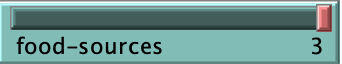
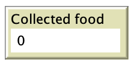
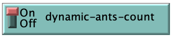
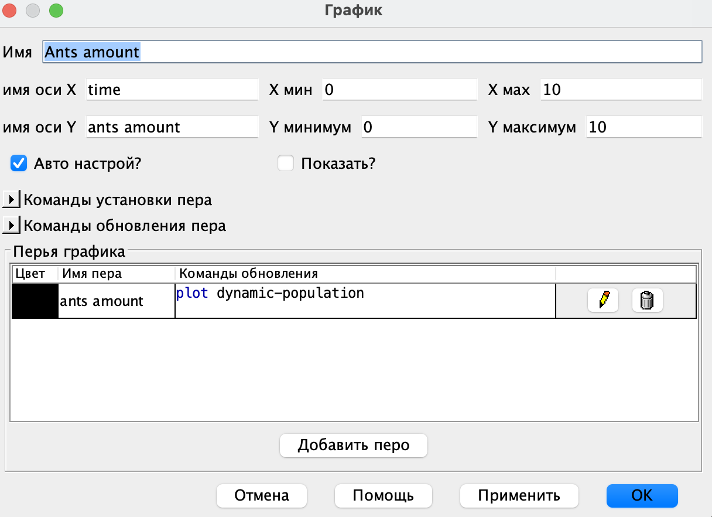
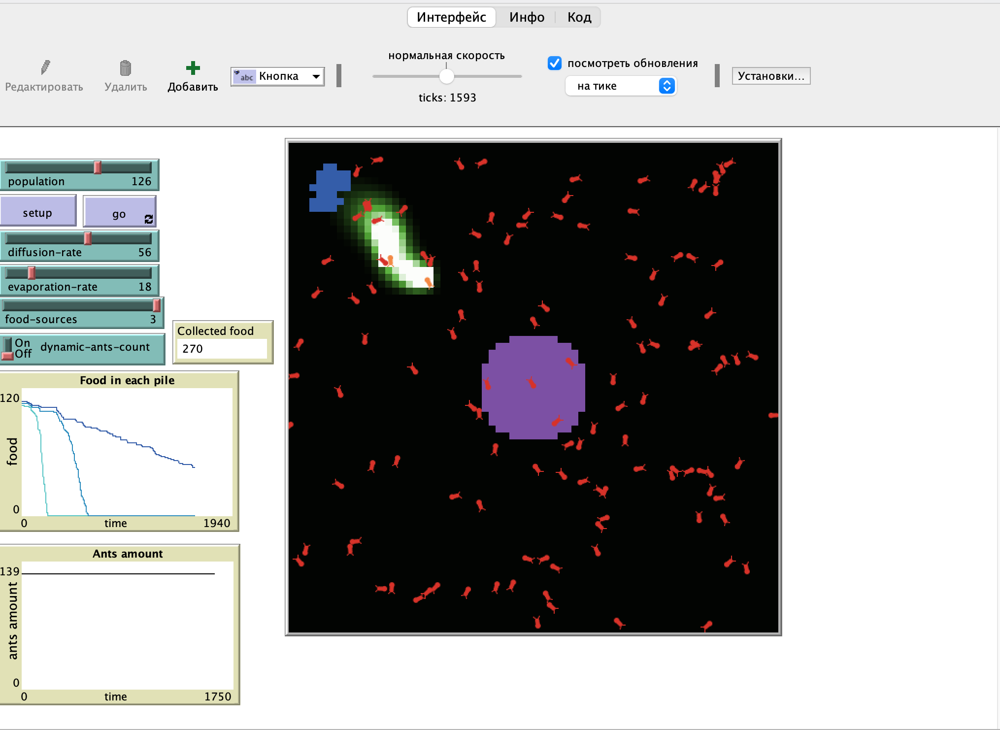

## Комп'ютерні системи імітаційного моделювання

## СПм-23-3, **Кужель Сергій Ігорович**

### Лабораторна робота №**2**. Редагування імітаційних моделей у середовищі NetLogo

 

### Варіант 10, модель у середовищі NetLogo:

[Ants](https://www.netlogoweb.org/launch#http://www.netlogoweb.org/assets/modelslib/Sample%20Models/Biology/Ants.nlogo)

 

### Внесені зміни у вихідну логіку моделі, за варіантом:

**1. Додати можливість вказувати кількість джерел їжі на полі.**
Для реалізації цієї логіки у інтерфейсі моделі був доданий повзунок з назвою **food-sources**.

Він приймає значення від 0 до 3 з кроком 1. Таким чином ми зможемо динамічно визначати кількість джерел їжі від 0 до 3.
Далі, у процедурі **setup-food** були внесені деякі зміни, а саме додані додаткові умови, які контролюють появу джерел їжі в залежності від показніка змінної **food-sources** (внесені зміни показані курсивом):

<pre>
to setup-food 
  if ((distancexy (0.6 * max-pxcor) 0) < 5) <i>and food-sources > 0</i> 
  [ set food-source-number 1 ]
  if ((distancexy (-0.6 * max-pxcor) (-0.6 * max-pycor)) < 5) <i>and food-sources > 1</i>
  [ set food-source-number 2 ]
  if ((distancexy (-0.8 * max-pxcor) (0.8 * max-pycor)) < 5) <i>and food-sources > 2</i> 
  [ set food-source-number 3 ]
  if food-source-number > 0
  [ set food one-of [1 2] ]
end
</pre>

**2. Ввести показник кількості зібраної їжі у гнізді, що відображається користувачеві.**
Для реалізації цієї логіки була додана глобальна змінна **collected-food**

<pre>
globals [
  collected-food       ;; ** amount of collected food
]
</pre>

Аби відстежувати кількість зібраної їжі, нам потрібно відстежувати момент, коли мураха приносить їжу до гнізда. Дана логіка реалізована у процедурі **return-to-nest**. Змінена процедура має наступний вигляд:

<pre>
to return-to-nest 
  ifelse nest?
  [ ;; drop food and head out again
    set color red
    <i>set collected-food collected-food + 1</i>
    rt 180
  ]
  [ set chemical chemical + 60  ;; drop some chemical
    uphill-nest-scent ]         ;; head toward the greatest value of nest-scent
end
</pre>

Для відображення даного показника, в інтерфейсі моделі був доданий компонент "Екран" зі встановленим датчиком "collected-food".

**3. Відключаєма можливість появи нових мурах за умов наявності достатньої кількості їжі у гнізді. Відображати графік зміни кількості мурах.**

Перш за все, до інтерфейсу був доданий перемикач **dynamic-ants-count**, який вмикає або вимикає описану в завданні логіку.

Далі була додана глобальна змінна **dynamic-population** - це внутрішня змінна, в якій буде зберігатися загальна кількість мурах (після генерації). У процедурі **setup** присвоюємо даній змінній значення, яке відповідає вхідному параметру **population**

<pre>
set dynamic-population population
</pre>

Наступний етап полягає в створенні нових мурах. Умова для їх генерації дуже проста: нова мураха з'являється, якщо кількість мурах дорівнює кількості зібраної їжі. Цю логіку слід реалізувати у вже відомій процедурі return-to-nest, оскільки генерація мурах повинна відбуватися після того, як мураха принесе їжу до гнізда. Ось як виглядає змінений код процедури:

<pre>
to return-to-nest 
  ifelse nest?
  [ ;; drop food and head out again
    set color red
    set collected-food collected-food + 1
    rt 180
    <i>if dynamic-ants-count and (collected-food = dynamic-population)
      [ set dynamic-population dynamic-population + 1
        hatch 1
      ]</i>
  ]
  [ set chemical chemical + 60  ;; drop some chemical
    uphill-nest-scent ]         ;; head toward the greatest value of nest-scent
end
</pre>

Останнім етапом є відображення графіку зміни кількості мурах. Для цього на інтерфейс моделі був доданий графік з наступними параметрами:

 

### Внесені зміни у вихідну логіку моделі, на власний розсуд:

**Додана логіка збільшення розміру гнізда в залежності від кільності зібранної їжі**.
Задумка проста, збільшувати розмір гнізда за кожні зібрані 50 одиниць їжі. Для цього була додана глобальна змінна **nest-size** в якій буде зберігатися розмір гнізда.

<pre>
globals [
  collected-food       ;; amount of collected food
  dynamic-population   ;; dynamic amount of ants
  nest-size            ;; size of the nest
]
</pre>

За замовчуванням розмір гнізда буде становити **3**. Це необхідно вказати в процедурі **setup**.

<pre>
set nest-size 3 
</pre>

У вихідній моделі розмір гнізда - константа, яка дорівнює 2 і задається у процедурі **setup-nest**. Тож нам необхідно замінити цю константу нашою змінною:

<pre>
set nest? (distancexy 0 0) < nest-size
</pre>

Наступним етапом є відслідковування кількіості зібраної їжі та збільшення розміру гнізда, тож модифікуємо процедуру **return-to-nest**:

<pre>

to return-to-nest  
  ifelse nest?
  [ ;; drop food and head out again
    set color red
    set collected-food collected-food + 1
    <i>if (collected-food / 50 + 3 > nest-size) and ((remainder collected-food 50) = 0) [
      set nest-size collected-food / 50 + 3
    ]</i>
    rt 180
    if dynamic-ants-count and (collected-food = dynamic-population) 
      [ set dynamic-population dynamic-population + 1
        hatch 1
      ]
  ]
  [ set chemical chemical + 60  ;; drop some chemical
    uphill-nest-scent ]         ;; head toward the greatest value of nest-scent
end
</pre>

Таким чином ми збільшуємо розмір гнізда кожні зібрані 50 одиниць їжі.

Останім етапом є відображення оновленого гнізда. Для цього у процедурі **go** потрібно викликати процедуру **setup-nest** яка буде перераховувати розмір гнізда. Оновлена процедура **go** має наступний вигляд:

<pre>
to go  ;; forever button
  ask turtles
  [ if who >= ticks [ stop ] ;; delay initial departure
    ifelse color = red
    [ look-for-food  ]       ;; not carrying food? look for it
    [ return-to-nest ]       ;; carrying food? take it back to nest
    wiggle
    fd 1 ]
  diffuse chemical (diffusion-rate / 100)
  ask patches
  [ set chemical chemical * (100 - evaporation-rate) / 100
    <i>setup-nest</i>
    recolor-patch ]
  tick
end
</pre>

Фінальний код моделі та її інтерфейс доступні за [посиланням](./lr2.nlogo).
 

## Обчислювальний експеримент

### Вплив параметру динамічної генерації мурах на загальну кількість зібраної їжі

Досліджується залежність кількості зібраної їжі після певної кількості тактів (1000) від параметру динамічної генерації мурах.
Експерименти проводяться при двох сценаріях: параметр **dynamic-ants-count** увімкнений та вимкнений.

Інші керуючі параметри мають наступні значення:

- **population**: 50
- **diffusion-rate**: 50
- **evaporation-rate**: 20
- **food-sources**: 3

<table>
<thead>
<tr><th>dynamic-ants-count</th><th>Кількість зібраної їжі</th></tr>
</thead>
<tbody>
<tr><td>On</td><td>261</td></tr>
<tr><td>Off</td><td>160</td></tr>
</tbody>
</table>

Як показано в таблиці, увімкнення опції dynamic-ants-count прискорює процес збору їжі завдяки поступовому збільшенню популяції мурах. Однак варто зазначити, що цей параметр має незначний вплив на результат при невеликій кількості тактів, оскільки генерація нових мурах починається лише після того, як популяція зібрає достатню кількість їжі, що може зайняти певний час.
